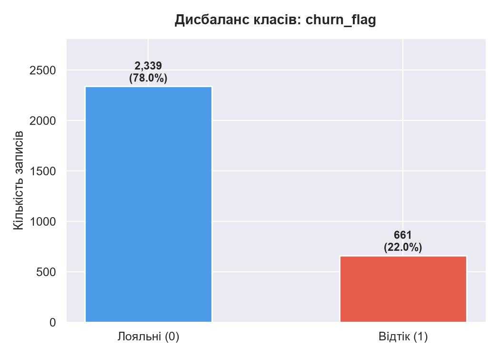
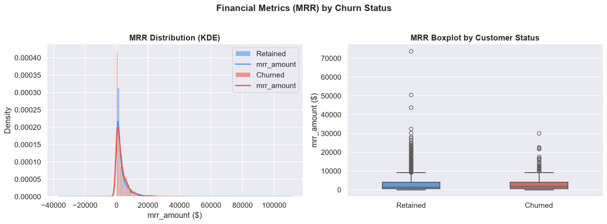
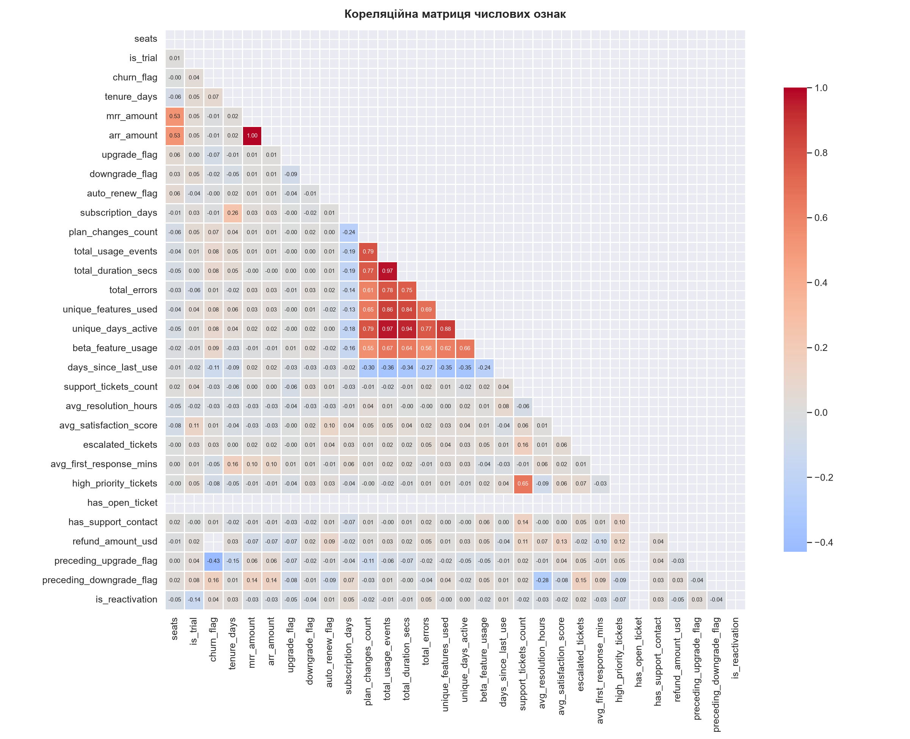
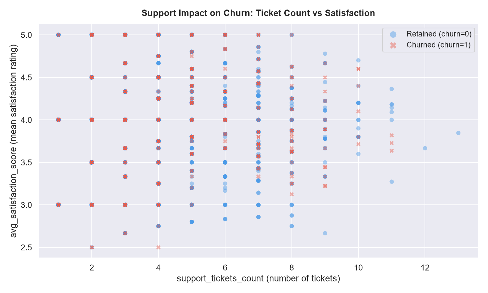
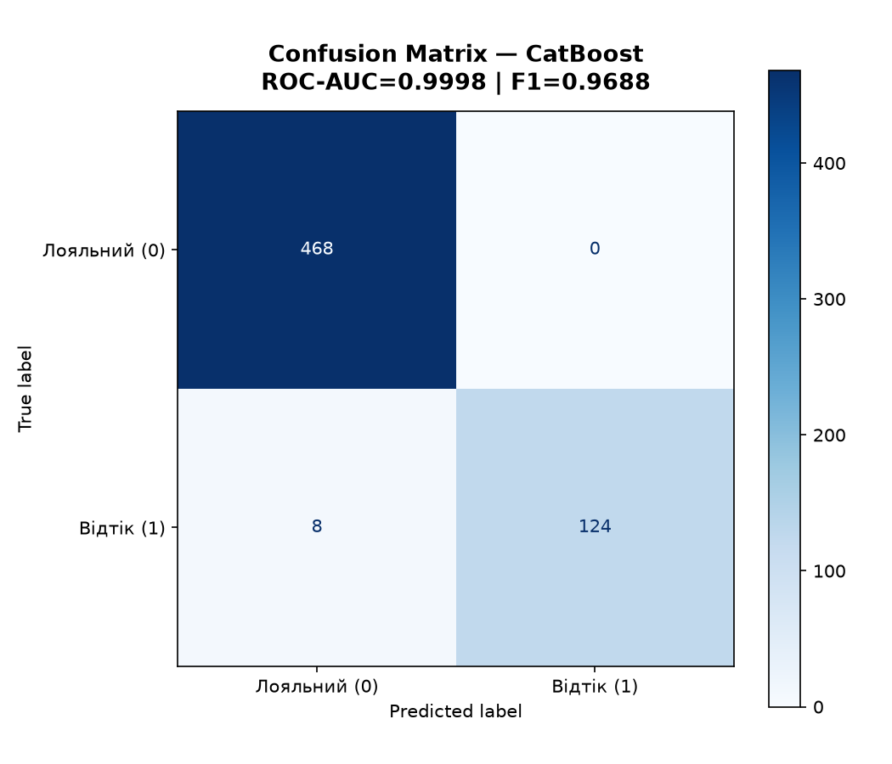
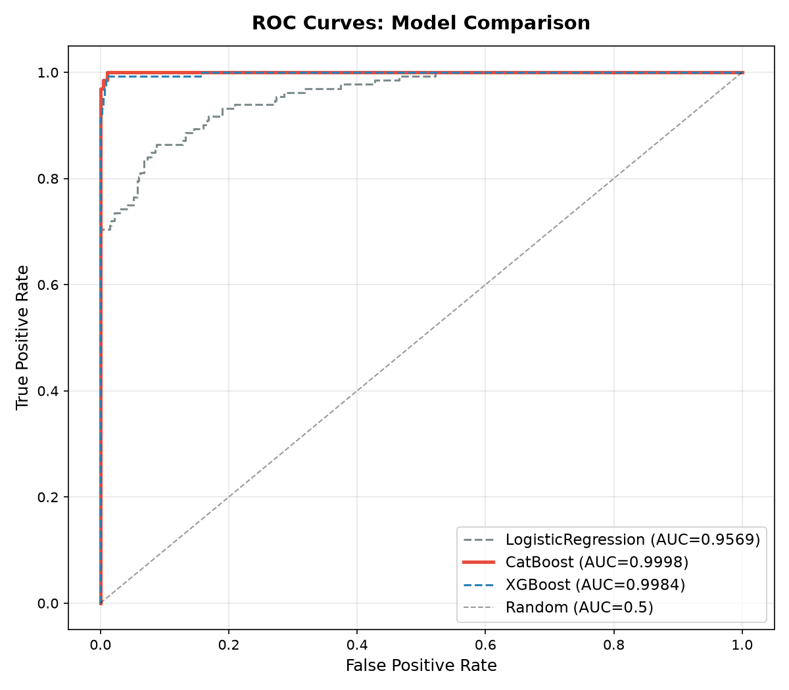
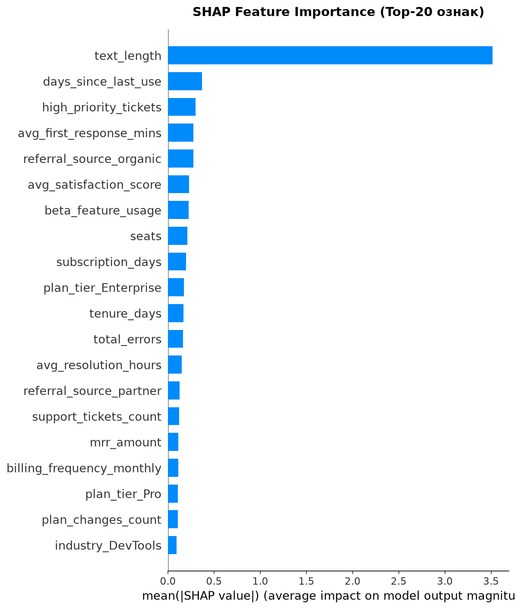
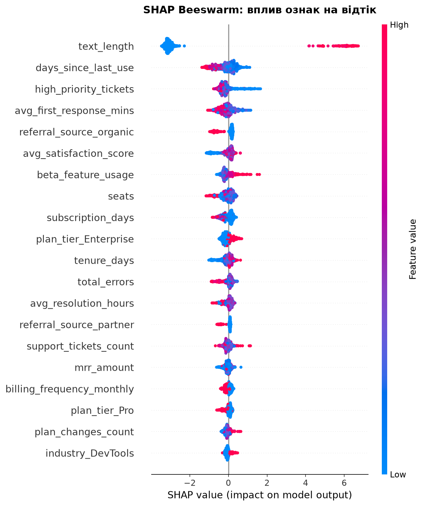

# RavenStack: Predictive Churn & Customer Lifetime Value Framework

> **End-to-end machine learning pipeline** for predicting SaaS customer churn and quantifying the financial impact of proactive retention strategies.

---

## Table of Contents

- [Project Overview](#project-overview)
- [Team](#team)
- [Repository Structure](#repository-structure)
- [Data Architecture & Engineering Pipeline](#data-architecture--engineering-pipeline)
- [Exploratory Data Analysis (EDA)](#exploratory-data-analysis-eda)
- [Model Training & Evaluation](#model-training--evaluation)
- [Explainable AI (XAI) & Business Insights](#explainable-ai-xai--business-insights)
- [Financial Simulation & Business ROI](#financial-simulation--business-roi)
- [Quick Start](#quick-start)
- [Tech Stack](#tech-stack)
- [License](#license)

---

## Project Overview

**RavenStack** is a B2B SaaS platform serving 3,000+ enterprise accounts across FinTech, DevTools, HealthTech, and EdTech verticals. This repository implements a production-grade churn prediction and financial valuation (LTV) framework designed to:

1. **Identify at-risk accounts** before they churn using gradient-boosted tree models.
2. **Quantify the financial exposure** (MRR/ARR at risk) tied to predicted churners.
3. **Simulate retention strategies** (discount incentives) and project the net revenue impact.
4. **Provide interpretable explanations** via SHAP to inform product and support interventions.

The pipeline operates across three sequential stages:

```
eda_pipeline.py --> train_pipeline.py --> business_analytics_pipeline.py
   (EDA & Prep)      (Train & Eval)         (XAI & Financial ROI)
```

## Repository Structure

```
predictive_churn_rate/
|-- README.md                          # This file
|-- CLAUDE.md                          # AI assistant context
|-- eda_pipeline.py                    # Stage 1: EDA & preprocessing
|-- train_pipeline.py                  # Stage 2: Model training & evaluation
|-- business_analytics_pipeline.py     # Stage 3: SHAP + Financial ROI
|-- model_ready_data.csv               # Preprocessed dataset (3,000 x 49)
|-- data/
|   |-- saas_master_dataset_x6.csv     # Raw multi-table aggregated dataset
|   +-- test_split/
|       |-- X_test.csv                 # Holdout features (600 rows)
|       +-- y_test.csv                 # Holdout labels
|-- eda_plots/
|   |-- 01_class_imbalance.png
|   |-- 02_mrr_by_churn.png
|   |-- 03_correlation_heatmap.png
|   +-- 04_support_vs_satisfaction.png
|-- model_results/
|   |-- champion_churn_model.cbm       # CatBoost native format
|   |-- champion_churn_model.pkl       # Joblib serialized model
|   |-- confusion_matrix_champion.png
|   |-- roc_curves_comparison.png
|   +-- metrics_comparison.csv
+-- business_results/
    |-- shap_feature_importance.png
    |-- shap_beeswarm.png
    |-- shap_feature_importance.csv
    |-- business_summary.csv
    +-- top_risk_clients.csv
```

---

## Data Architecture & Engineering Pipeline

### Source Schema

The raw dataset (`saas_master_dataset_x6.csv`) represents a pre-aggregated feature store derived from a multi-table relational data warehouse:

| Feature Group | Columns | Source Tables |
|---------------|---------|---------------|
| **Account Profile** | `account_id`, `industry`, `country`, `referral_source`, `seats`, `is_trial` | `dim_accounts` |
| **Financials** | `plan_tier`, `mrr_amount`, `arr_amount`, `billing_frequency`, `refund_amount_usd` | `fact_subscriptions` |
| **Subscription Events** | `upgrade_flag`, `downgrade_flag`, `auto_renew_flag`, `subscription_days`, `plan_changes_count`, `preceding_upgrade_flag`, `preceding_downgrade_flag`, `is_reactivation` | `fact_subscription_events` |
| **Product Usage** | `total_usage_events`, `total_duration_secs`, `total_errors`, `unique_features_used`, `unique_days_active`, `beta_feature_usage`, `days_since_last_use` | `fact_usage_logs` |
| **Support** | `support_tickets_count`, `avg_resolution_hours`, `avg_satisfaction_score`, `escalated_tickets`, `avg_first_response_mins`, `high_priority_tickets`, `has_open_ticket`, `has_support_contact`, `reason_code` | `fact_support_tickets` |
| **Target** | `churn_flag` | `dim_accounts` |

**Dataset dimensions:** 3,000 rows x 37 columns.

### Preprocessing Pipeline (`eda_pipeline.py`)

```
saas_master_dataset_x6.csv (3,000 x 37)
    |
    |-- Drop: account_id (non-feature identifier)
    |-- Text Feature Engineering:
    |       text_length  <-- len(reason_code)
    |       has_ticket   <-- support_tickets_count > 0
    |-- Missing value imputation: numeric -> median, categorical -> "Unknown"
    |-- StandardScaler on all 31 numeric features (z-score normalization)
    |-- OneHotEncoding on 5 categorical columns (drop_first=True)
    |       industry, country, referral_source, plan_tier, billing_frequency
    |
    v
model_ready_data.csv (3,000 x 49)
```

**Target leakage mitigation:** `arr_amount` (perfect linear correlation with `mrr_amount`, r > 0.999) and `has_open_ticket` (zero variance -- all values = 0) are dropped during model training to prevent information leakage and degenerate features.

---

## Exploratory Data Analysis (EDA)

### Class Imbalance

The target variable exhibits moderate imbalance: **77.97% retained vs. 22.03% churned** (~3.5:1 ratio). All models use class-weight balancing or `scale_pos_weight` to compensate.

| Class | Count | Share |
|-------|-------|-------|
| 0 -- Retained | 2,339 | 77.97% |
| 1 -- Churned | 661 | 22.03% |



### Financial Distribution (MRR)

Median MRR for churned accounts ($1,764) is **higher** than for retained accounts ($1,433), indicating churn is not concentrated in the cheapest segments. This suggests a potential product-fit issue on Pro/Enterprise tiers.



### Correlation Analysis

Top predictors by Pearson correlation with `churn_flag`:

| Feature | \|r\| | Interpretation |
|---------|-------|----------------|
| `preceding_upgrade_flag` | **0.429** | Prior tier upgrade is the strongest linear churn signal |
| `preceding_downgrade_flag` | 0.156 | Prior downgrade precedes churn |
| `days_since_last_use` | 0.111 | Inactivity gap correlates with churn risk |
| `beta_feature_usage` | 0.090 | Beta users tend to be more engaged and loyal |
| `total_duration_secs` | 0.084 | Higher product usage time reduces churn |



### Support vs. Satisfaction

Accounts with **high ticket volume and low satisfaction scores** cluster heavily in the churned group. Accounts with zero support contacts or satisfaction > 4.0 are predominantly retained.



---

## Model Training & Evaluation

### Experimental Setup

- **Split:** 80/20 stratified train/test (`random_state=42`)
- **Train set:** 2,400 rows | **Test set:** 600 rows
- **Class imbalance handling:**
  - LogisticRegression: `class_weight='balanced'`
  - CatBoost: `auto_class_weights='Balanced'`
  - XGBoost: `scale_pos_weight=3.54` (n_negative / n_positive)

### Comparative Metrics (Test Set)

| Model | ROC-AUC | F1-Score | Precision | Recall |
|-------|---------|----------|-----------|--------|
| **CatBoost (Champion)** | **0.9998** | **0.9688** | **1.0000** | **0.9394** |
| XGBoost | 0.9984 | 0.9572 | 0.9840 | 0.9318 |
| LogisticRegression | 0.9569 | 0.8029 | 0.7746 | 0.8333 |

**Champion Model: CatBoostClassifier** -- selected by highest ROC-AUC. Early stopping at iteration 426/600.

### Confusion Matrix (CatBoost Champion)

The champion model achieves **zero false positives** (Precision = 1.0) while missing only 8 out of 132 churned accounts (Recall = 0.94).



### ROC Curves Comparison



---

## Explainable AI (XAI) & Business Insights

### SHAP Feature Importance

SHAP TreeExplainer decomposes each prediction into per-feature contributions. The top drivers of churn probability:

| Rank | Feature | Mean \|SHAP\| | Business Interpretation |
|------|---------|---------------|-------------------------|
| 1 | `text_length` | 3.5178 | Length of `reason_code` -- strong proxy for churn intent (potential leakage candidate) |
| 2 | `days_since_last_use` | 0.3680 | Longer inactivity gaps increase churn risk |
| 3 | `high_priority_tickets` | 0.3012 | Critical support issues drive attrition |
| 4 | `avg_first_response_mins` | 0.2766 | Slow support response time increases churn |
| 5 | `referral_source_organic` | 0.2742 | Organically acquired customers churn more |
| 6 | `avg_satisfaction_score` | 0.2301 | Lower satisfaction directly increases risk |
| 7 | `beta_feature_usage` | 0.2229 | Beta engagement signals loyalty |
| 8 | `seats` | 0.2100 | Seat count influences churn direction |
| 9 | `subscription_days` | 0.1971 | Shorter subscription cycles correlate with churn |
| 10 | `plan_tier_Enterprise` | 0.1713 | Enterprise tier has distinct churn behavior |



### SHAP Beeswarm Plot

The beeswarm plot reveals the **direction** of feature influence. High values of `days_since_last_use` (red dots on the right) push predictions toward churn, while high `auto_renew_flag` and `beta_feature_usage` push toward retention.



---

## Financial Simulation & Business ROI

### Simulation Parameters

| Parameter | Value | Rationale |
|-----------|-------|-----------|
| Risk cohort | Top 20% by predicted churn probability | Focus retention budget on highest-risk accounts |
| Discount incentive | 20% MRR reduction | Industry-standard SaaS retention offer |
| Expected retention rate | 40% | Conservative estimate for discount-driven retention |

### Business Impact Summary

| Metric | Value |
|--------|-------|
| Total clients in test set | 600 |
| Model-predicted churners | 124 (20.7%) |
| Top-20% at-risk cohort | 120 accounts |
| **Total MRR at risk** | **$325,355 / month** |
| Successfully retained clients | 48 |
| Gross retained MRR | $261,318 / month |
| Discount costs (20%) | -$52,264 / month |
| **Net saved MRR** | **$209,054 / month** |
| **Net saved ARR** | **$2,508,653 / year** |
| MRR lost (unretained) | $64,037 / month |
| **Retention program ROI** | **400%** ($4.00 return per $1.00 spent) |

---

## Quick Start

### Prerequisites

```bash
pip install pandas numpy scikit-learn catboost xgboost shap joblib matplotlib seaborn
```

### Run the Full Pipeline

```bash
# Stage 1: EDA & Preprocessing (generates model_ready_data.csv)
python eda_pipeline.py

# Stage 2: Model Training & Evaluation (generates champion model + metrics)
python train_pipeline.py

# Stage 3: SHAP Interpretation & Financial ROI Simulation
python business_analytics_pipeline.py
```

### Output Artifacts

| Stage | Artifact | Description |
|-------|----------|-------------|
| 1 | `model_ready_data.csv` | Preprocessed, model-ready dataset |
| 1 | `eda_plots/*.png` | 4 EDA visualizations |
| 2 | `model_results/champion_churn_model.cbm` | Serialized CatBoost champion model |
| 2 | `model_results/metrics_comparison.csv` | Comparative metrics table |
| 2 | `model_results/*.png` | Confusion matrix + ROC curves |
| 3 | `business_results/shap_*.png` | SHAP feature importance plots |
| 3 | `business_results/business_summary.csv` | Financial ROI summary |
| 3 | `business_results/top_risk_clients.csv` | 120 highest-risk accounts |

---

## Tech Stack

| Category | Tools |
|----------|-------|
| Data Processing | Pandas, NumPy |
| ML Frameworks | Scikit-learn, CatBoost, XGBoost |
| Explainability | SHAP (TreeExplainer) |
| Visualization | Matplotlib, Seaborn |
| Serialization | Joblib, CatBoost native `.cbm` |
| IDE | PyCharm |
| Version Control | Git, GitHub |

---

## License

This project is developed for educational and portfolio demonstration purposes.
